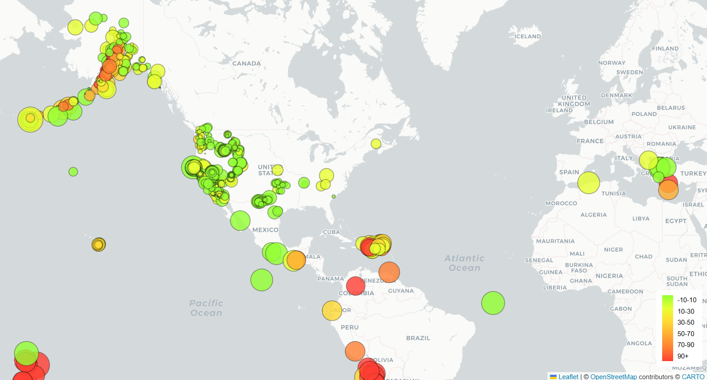

# 👋 Hi, I'm Christine Bilinski

📊 Data Analytics Bootcamp Graduate  
💡 Passionate about transforming data into clear insights through dashboards and visualizations.

Welcome to my GitHub portfolio. Here you will find projects demonstrating skills in **data analysis, visualization, and interactive dashboards.**

---

# 🚀 Portfolio Projects

<table>
<tr>
<td width="50%">

### 🌎 Earthquake Visualization Map

Interactive map displaying global earthquake activity using **Leaflet.js**.

</td>

<td width="50%">

### 📊 Data Dashboard (Project 3)

Interactive dashboard exploring patterns and trends in data.

</td>
</tr>

<tr>
<td width="50%">

### 🧫 Belly Button Biodiversity Dashboard

Interactive dashboard exploring bacteria cultures using **Plotly.js**.

</td>

<td width="50%">

### 📈 Data Visualization Projects

Additional projects exploring visualization and storytelling with data.

</td>
</tr>
</table>

---

# 🧰 Technical Skills

### Programming Languages
- Python
- JavaScript

### Data Visualization
- Plotly
- Leaflet
- Interactive dashboards

### Web Technologies
- HTML
- CSS
- GitHub Pages

### Data Skills
- Data analysis
- Data visualization
- Dashboard design
- Data storytelling

---

# 📊 GitHub Stats

---

# 📚 Currently Learning

- Advanced data visualization
- Data storytelling
- Dashboard design best practices

---

# 💡 How to Explore My Projects

Even if you're new to GitHub:

1️⃣ Scroll to **Portfolio Projects**  
2️⃣ Click a **project image**  
3️⃣ The interactive project will open in your browser  
4️⃣ Explore the map or dashboard

No downloads required.

---

# 🔗 Connect With Me

LinkedIn  
https://linkedin.com/in/christine-b-19367b31b

---

⭐ Thank you for visiting my GitHub!
