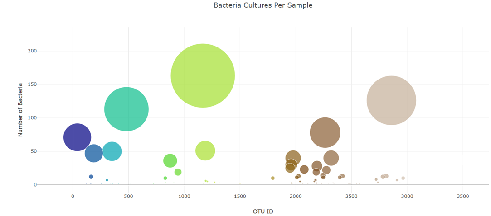
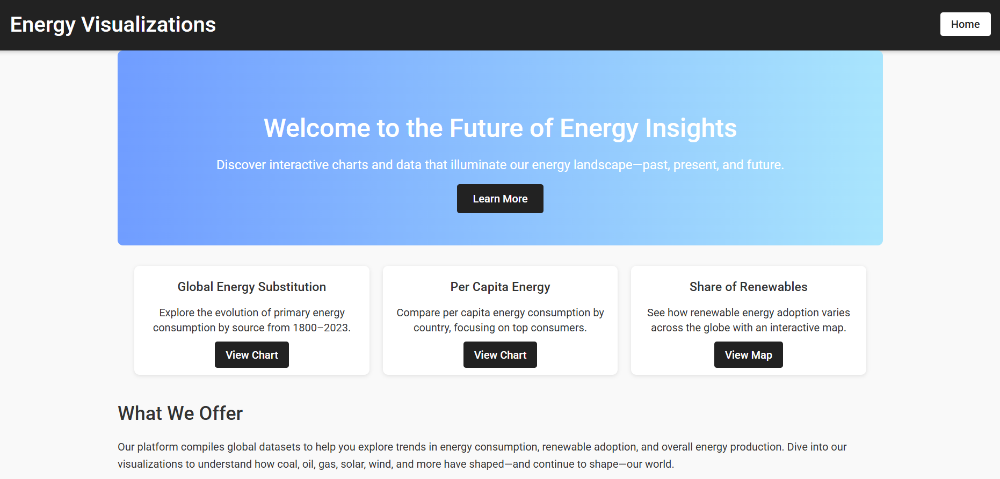

<table>
<tr>
<td width="220">

</td>

<td>

# Hi, I'm Christine Bilinski 👋

📊 **Data Analytics Graduate**  
🤝 **Customer Success Professional**  
💡 I turn messy data into clear insights people can understand.

Sometimes that means dashboards.  
Sometimes that means spreadsheets.  
Sometimes it just means asking better questions.

---

### 🔗 Connect With Me

📧 **Email**  
cbilinski101@gmail.com  

💼 **LinkedIn**  
https://www.linkedin.com  

🌐 **Portfolio Website**  
https://cbilinski101.github.io  

📄 **Resume**  
[Download Resume](https://cbilinski101.github.io/Christine_Bilinski_Resume.pdf)

💻 **GitHub**  
https://github.com/cbilinski101

</td>
</tr>
</table>

---

# Featured Projects

### 🌎 Global Earthquake Visualization

Interactive map visualizing global earthquake activity with magnitude-scaled markers and tectonic plate overlays.

**Tools used**

- JavaScript  
- Leaflet  
- GeoJSON  
- Data Visualization  

---

### 🧬 Microbiome Data Visualization

Bubble chart exploring bacterial cultures per sample using dynamic bubble sizing to highlight dominant species.

**Tools used**

- Python  
- Plotly  
- Data Exploration  
- Visualization  

---

### ⚡ Energy Analytics Dashboard

Interactive dashboard exploring global energy trends, renewable adoption, and consumption patterns.

**Tools used**

- Python  
- Data Analytics  
- Interactive Dashboards  
- Data Visualization  

---

# Technical Skills

### Data Analysis

- Python  
- Pandas  
- Jupyter Notebook  
- Data Cleaning  
- Data Visualization  

### Tools

- GitHub  
- Excel  
- Google Colab  
- CRM Platforms  
- Data Reporting  

### Strengths

- Customer Success  
- Problem Solving  
- Communication  
- Process Improvement  
- Relationship Building  

---

# A Quick Note

If you're a hiring manager visiting this page — welcome!

This GitHub is a collection of projects from my **data analytics training and hands-on work with data visualization**.

I enjoy turning complicated information into clear insights that help teams make better decisions.

And yes — sometimes that involves a lot of coffee ☕.

---

© Christine Bilinski
